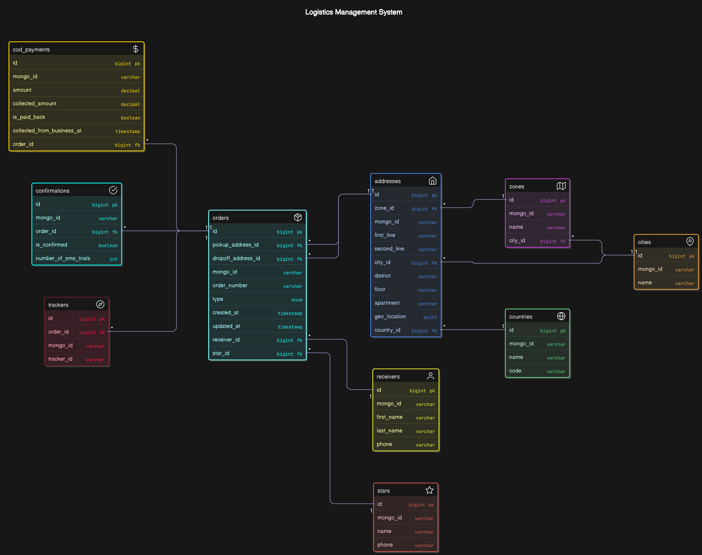

## **Data Modeling Documentation**

### Table of Contents

1. [Introduction](#1-introduction)

2. [Source Data (MongoDB Schemas)](#2-source-data-mongodb-schemas)

   - [countryCollection](#1-countrycollection)
   - [zoneCollection](#2-zonecollection)
   - [cityCollection](#3-citycollection)
   - [receiverCollection](#4-receivercollection)
   - [starCollection](#5-starcollection)
   - [trackerCollection](#6-trackercollection)
   - [orderCollection](#7-ordercollection)

3. [Database Model Overview](#3-database-model-overview)

   - [Geographical Tables](#geographical-tables)
   - [Address Table](#address-table)
   - [Order-Related Tables](#order-related-tables)
   - [Person-Related Tables](#person-related-tables)

4. [Tables and Columns](#4-tables-and-columns)

   - [Geographical Tables](#geographical-tables-1)
     - [countries](#1-countries)
     - [cities](#2-cities)
     - [zones](#3-zones)
   - [Address Table](#address-table-1)
     - [addresses](#4-addresses)
   - [Order-Related Tables](#order-related-tables-1)
     - [orders](#5-orders)
     - [cod_payments](#6-cod_payments)
     - [confirmations](#7-confirmations)
     - [trackers](#8-trackers)
   - [Person-Related Tables](#person-related-tables-1)
     - [receivers](#9-receivers)
     - [stars](#10-stars)

5. [Relationships](#5-relationships)

   - [addresses relationships](#addresses)
   - [orders relationships](#orders)
   - [cod_payments and confirmations relationships](#cod_payments-and-confirmations)
   - [trackers relationships](#trackers)

6. [ER Diagram](#6-er-diagram)

7. [Design Justification](#7-design-justification)

   - [Normalization](#normalization)
   - [Indexes](#indexes)
   - [Foreign Keys](#foreign-keys)
   - [Enums](#enums)
   - [Timestamps](#timestamps)

8. [Sample Data](#8-sample-data)

   - [Original JSON Data](#original-json-data)
   - [Flattened Data](#flattened-data)

9. [Conclusion](#9-conclusion)

Attachments

- [ER Diagram](#er-diagram)
- [Sample JSON Data](#sample-json-data)
- [Sample CSV Data](#sample-csv-data)

---

### **1. Introduction**

This document provides an overview of the database model designed for the ETL pipeline. The model is structured to ensure data integrity, avoid redundancy, and support efficient querying. Below, we describe the tables, columns, relationships, and the reasoning behind the design choices.

---

### **2. Source Data (MongoDB Schemas)**

The source data is stored in MongoDB, with the following collections and schemas:

1. **`countryCollection`**:

   - **Schema**: `Country`
   - **Fields**:
     - `name`: String (required)
     - `code`: String (required)
     - `createdAt`: DateTime (default: current time)
     - `updatedAt`: DateTime (default: current time, updated on save)

2. **`zoneCollection`**:

   - **Schema**: `Zone`
   - **Fields**:
     - `name`: String (required)
     - `createdAt`: DateTime (default: current time)
     - `updatedAt`: DateTime (default: current time, updated on save)

3. **`cityCollection`**:

   - **Schema**: `City`
   - **Fields**:
     - `name`: String (required, unique)
     - `createdAt`: DateTime (default: current time)
     - `updatedAt`: DateTime (default: current time, updated on save)

4. **`receiverCollection`**:

   - **Schema**: `Receiver`
   - **Fields**:
     - `firstName`: String (required)
     - `lastName`: String (required)
     - `phone`: String (required)
     - `createdAt`: DateTime (default: current time)
     - `updatedAt`: DateTime (default: current time, updated on save)

5. **`starCollection`**:

   - **Schema**: `Star`
   - **Fields**:
     - `name`: String (required)
     - `phone`: String (required)
     - `createdAt`: DateTime (default: current time)
     - `updatedAt`: DateTime (default: current time, updated on save)

6. **`trackerCollection`**:

   - **Schema**: `Tracker`
   - **Fields**:
     - `orderId`: String (required)
     - `createdAt`: DateTime (default: current time)
     - `updatedAt`: DateTime (default: current time, updated on save)

7. **`orderCollection`**:
   - **Schema**: `Order`
   - **Fields**:
     - `cod`: EmbeddedDocument (contains `amount`, `isPaidBack`, `collectedAmount`)
     - `collectedFromBusiness`: DateTime (required)
     - `confirmation`: EmbeddedDocument (contains `isConfirmed`, `numberOfSmsTrials`)
     - `dropOffAddress`: EmbeddedDocument (contains `floor`, `apartment`, `secondLine`, `city`, `zone`, `district`, `firstLine`, `geoLocation`, `country`)
     - `pickupAddress`: EmbeddedDocument (similar to `dropOffAddress`)
     - `receiver`: Reference to `Receiver`
     - `star`: Reference to `Star`
     - `tracker`: Reference to `Tracker`
     - `orderId`: String (required)
     - `type`: String (choices: `SEND`, `OTHER`)
     - `createdAt`: DateTime (default: current time)
     - `updatedAt`: DateTime (default: current time, updated on save)

---

### **3. Database Model Overview**

The database model consists of the following tables:

- **Geographical Tables**: `countries`, `cities`, `zones`
- **Address Table**: `addresses`
- **Order-Related Tables**: `orders`, `cod_payments`, `confirmations`, `trackers`
- **Person-Related Tables**: `receivers`, `stars`

Each table is designed to store specific types of data, with relationships defined using foreign keys to maintain referential integrity.

---

### **4. Tables and Columns**

#### **Geographical Tables**

1. **`countries`**:

   - **Columns**: `id`, `mongo_id`, `name`, `code`, `created_at`, `updated_at`
   - **Purpose**: Stores country information.

2. **`cities`**:

   - **Columns**: `id`, `mongo_id`, `name`, `created_at`, `updated_at`
   - **Purpose**: Stores city information, linked to countries.

3. **`zones`**:
   - **Columns**: `id`, `mongo_id`, `name`, `created_at`, `updated_at`
   - **Purpose**: Stores zone information, linked to cities.

#### **Address Table**

4. **`addresses`**:
   - **Columns**: `id`, `order_mongo_id`, `first_line`, `second_line`, `district`, `floor`, `apartment`, `geo_location`, `zone_id`, `city_id`, `country_id`, `created_at`, `updated_at`, `type`
   - **Purpose**: Stores pickup and drop-off addresses, linked to zones, cities, and countries.

#### **Order-Related Tables**

5. **`orders`**:

   - **Columns**: `id`, `mongo_id`, `order_number`, `type`, `pickup_address_id`, `dropoff_address_id`, `receiver_id`, `star_id`, `created_at`, `updated_at`
   - **Purpose**: Stores order information, linked to addresses, receivers, and stars.

6. **`cod_payments`**:

   - **Columns**: `id`, `order_id`, `amount`, `collected_amount`, `is_paid_back`, `collected_from_business_at`, `created_at`, `updated_at`
   - **Purpose**: Stores cash-on-delivery (COD) payment details, linked to orders.

7. **`confirmations`**:

   - **Columns**: `id`, `order_id`, `is_confirmed`, `number_of_sms_trials`, `created_at`, `updated_at`
   - **Purpose**: Stores order confirmation details, linked to orders.

8. **`trackers`**:
   - **Columns**: `id`, `mongo_id`, `order_id`, `order_number`, `created_at`, `updated_at`
   - **Purpose**: Stores order tracking information, linked to orders.

#### **Person-Related Tables**

9. **`receivers`**:

   - **Columns**: `id`, `mongo_id`, `first_name`, `last_name`, `phone`, `created_at`, `updated_at`
   - **Purpose**: Stores receiver information.

10. **`stars`**:
    - **Columns**: `id`, `mongo_id`, `name`, `phone`, `created_at`, `updated_at`
    - **Purpose**: Stores star (delivery personnel) information.

---

### **5. Relationships**

The database model establishes the following relationships between tables:

- **`addresses`**:
  - Linked to `zones`, `cities`, and `countries` via `zone_id`, `city_id`, and `country_id`.
- **`orders`**:
  - Linked to `addresses` via `pickup_address_id` and `dropoff_address_id`.
  - Linked to `receivers` via `receiver_id`.
  - Linked to `stars` via `star_id`.
- **`cod_payments`** and **`confirmations`**:
  - Linked to `orders` via `order_id`.
- **`trackers`**:
  - Linked to `orders` via `order_id`.

---

### **6. ER Diagram**



---

### **7. Design Justification**

- **Normalization**: The model is normalized to Third Normal Form (3NF) to eliminate redundancy and ensure data integrity.
- **Indexes**: Indexes are created on frequently queried columns (e.g., `geo_location`, `created_at`) to optimize query performance.
- **Foreign Keys**: Foreign keys enforce referential integrity, ensuring that relationships between tables are valid.
- **Enums**: Enums (e.g., `type` in `orders` and `addresses`) restrict values to predefined options, ensuring data consistency.
- **Timestamps**: `created_at` and `updated_at` columns provide an audit trail for tracking changes.

---

### **8. Sample Data**

- **Original JSON Data**: A sample of the original JSON data is provided in the `source_sample` directory.

example:

```json
{
  "_id": {
    "$oid": "67a3da68f64b0a4eb35f9874"
  },
  "cod": {
    "amount": 309,
    "isPaidBack": false,
    "collectedAmount": 323
  },
  "collectedFromBusiness": {
    "$date": "2025-02-05T23:38:48.549Z"
  },
  "confirmation": {
    "isConfirmed": false,
    "numberOfSmsTrials": 0
  },
  "dropOffAddress": {
    "secondLine": "Luxor - District 3",
    "city": {
      "$oid": "67a3da68f64b0a4eb35f986f"
    },
    "zone": {
      "$oid": "67a3da68f64b0a4eb35f9870"
    },
    "district": "Luxor District",
    "firstLine": "Luxor, Egypt",
    "geoLocation": [
      31.342895977029666,
      26.93499604416562
    ]
  },
  "pickupAddress": {
    "floor": "1",
    "apartment": "33",
    "secondLine": "47 Random Street, Luxor",
    "city": {
      "$oid": "67a3da68f64b0a4eb35f986f"
    },
    "zone": {
      "$oid": "67a3da68f64b0a4eb35f9870"
    },
    "district": "Luxor",
    "firstLine": "Luxor, Egypt",
    "geoLocation": [
      30.80309656738026,
      25.829779458251743
    ],
    "country": {
      "$oid": "67a3da68f64b0a4eb35f986e"
    }
  },
  "receiver": {
    "$oid": "67a3da68f64b0a4eb35f9871"
  },
  "star": {
    "$oid": "67a3da68f64b0a4eb35f9872"
  },
  "tracker": {
    "$oid": "67a3da68f64b0a4eb35f9873"
  },
  "orderId": "4233895-0",
  "type": "SEND",
  "updatedAt": {
    "$date": "2025-02-05T21:38:48.550Z"
  },
  "createdAt": {
    "$date": "2025-02-05T23:38:48.549Z"
  }
},
```

- **Flattened Data**: A sample of the flattened data in CSV format is provided in the `output_sample` directory.

example:

| id  | mongo_id                 | order_number | type | pickup_address_id | dropoff_address_id | receiver_id | star_id | created_at          | updated_at          |
| --- | ------------------------ | ------------ | ---- | ----------------- | ------------------ | ----------- | ------- | ------------------- | ------------------- |
| 1   | 67a3da68f64b0a4eb35f9874 | 4233895-0    | SEND | 1                 | 11                 | 1           | 1       | 2025-02-05 23:38:49 | 2025-02-05 21:38:49 |
| 2   | 67a3da68f64b0a4eb35f987a | 4233895-1    | SEND | 2                 | 12                 | 2           | 2       | 2025-02-05 23:38:49 | 2025-02-05 21:38:49 |

---

### **9. Conclusion**

The database model is designed to be scalable, maintainable, and efficient. By organizing data into logical tables, using foreign keys to enforce relationships, and leveraging indexes for performance, the model ensures data integrity and supports complex queries. The provided ER diagram and sample data further illustrate the structure and functionality of the model.

---

## **Attachments**

1. **ER Diagram**: A visual representation of the database model.
2. **Sample JSON Data**: Located in the `source_sample` directory.
3. **Sample CSV Data**: Located in the `output_sample` directory.
